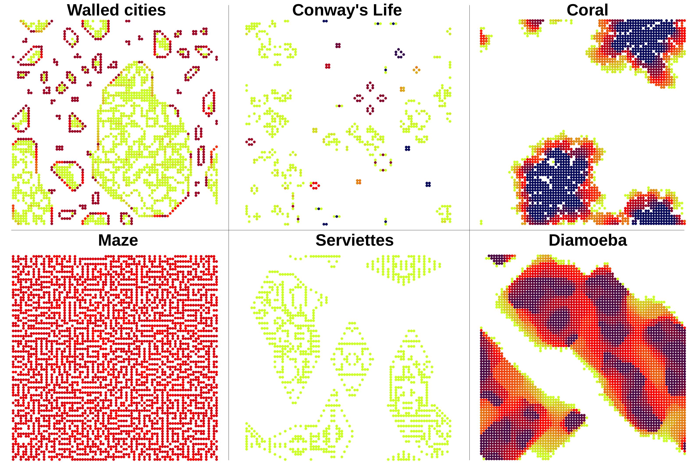
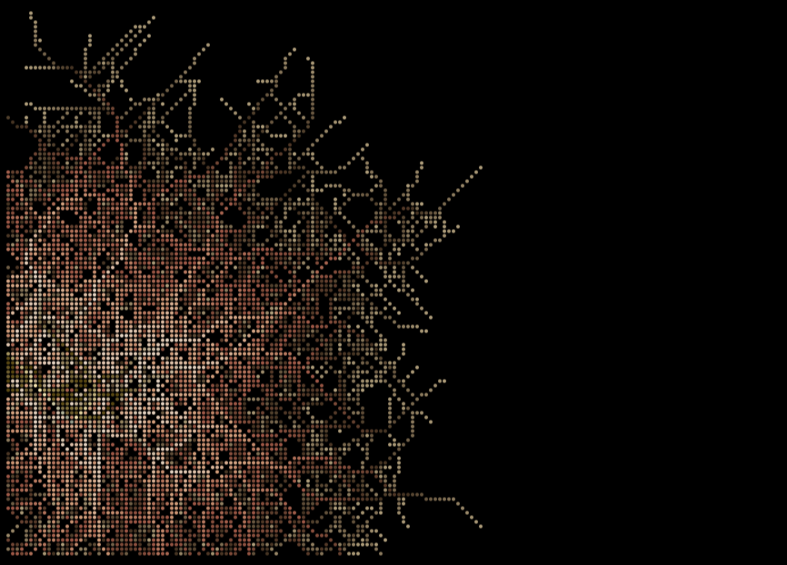

# Automates

**Automates** is a small OCaml application for exploring two-dimensional cellular automata. It was originally designed as a flexible playground for testing simple local rules that can generate complex spatial patterns, such as Conway-like automata, cyclic automata, coral-like growth, maze-forming systems, and other rule-based models.

The program combines a lightweight graphical interface, Cairo-based rendering, and a plugin system that makes it possible to add new automata without modifying the core engine.



---

## General principle

Cellular automata are discrete models in which a grid of cells evolves over time according to local rules. Each cell has a state, and each new generation is computed from the current state of the grid and, typically, the state of neighboring cells.

Despite their simplicity, cellular automata can generate rich and sometimes unexpected patterns. They are useful for exploring how complex spatial structures may emerge from simple rules, making them relevant for teaching, visualization, prototyping, and conceptual modeling.

In **Automates**, the universe is represented as a two-dimensional matrix. At each iteration, an automaton-specific `evolve` function computes the next generation. The graphical layer then updates the display efficiently using Cairo.

---

## Features

- Two-dimensional cellular automata on a configurable grid
- Modular plugin architecture
- Cairo-based graphical rendering
- Support for multiple cell states and color schemes
- Import/export of automaton states
- Optional saving of successive frames as PNG images
- Command-line settings for grid size, seed, speed, plugins, and display options
- Support for automata with standard local rules as well as more specialized update logic


---

## Plugin architecture

The main strength of **Automates** is its plugin system. Each automaton is implemented as an independent module matching a common interface.

A plugin defines:

- the size of the universe;
- the number of cell states;
- functions to create, import, and export matrices;
- an `evolve` function that computes the next generation.

This makes it possible to add new automata by writing dedicated plugins while keeping the graphical interface, rendering system, settings, and execution logic unchanged.

A typical plugin can implement classical cellular automata based on birth/survival rules, but it can also define more complex behaviors. The `evolve` function receives the full matrix, which allows the plugin to implement rules that go beyond simple cell-autonomous updates.

This design makes the program suitable for comparing different classes of automata within the same framework.

---

## From cellular automata to agent-like models

Although **Automates** was initially written for cellular automata, its architecture can be extended to more agent-like systems.

In a classical cellular automaton, each grid cell carries a simple state and evolves according to local neighborhood rules. In an agent-like extension, some cells can represent entities with richer internal states, such as:

- position;
- age;
- polarity or direction;
- activity status;
- branching competence;
- interaction state;
- local memory.

Such information can either be encoded directly in the cell state or stored in auxiliary data structures managed by the plugin. The visible grid then serves as a spatial support, while the plugin implements the behavior of active entities.

This makes it possible to prototype simple rule-based models of growth, branching, collision, exclusion, or interaction between spatial entities.

For example, a hyphal-growth plugin can represent active hyphal tips as agent-like entities that extend, branch, reorient, or stop according to local rules. Such models are deliberately minimal, but they provide a useful way to formalize assumptions and explore how network-like patterns can emerge from local decisions.



---

## Dependencies

The current version requires:

- OCaml
- `ocamlfind`
- `lablgtk3`
- `cairo2`
- `str`
- `unix`
- `dynlink`

On Debian/Ubuntu-like systems, the required packages may be installed with commands similar to:

```bash
sudo apt install ocaml ocaml-findlib liblablgtk3-ocaml-dev libcairo2-ocaml-dev
```

Depending on the distribution, package names may vary.

You can check that the required OCaml packages are available with:

```bash
ocamlfind list | grep -E 'lablgtk3|cairo2|str'
```

## Building

From the project directory, run:

```bash
./build.sh
```

or, depending on the local organization of the repository:

```bash
cd Sources
make
```

The executable is generated under the configured build directory.

## Running

A typical execution uses the compiled executable:

```bash
./automates
```

Several settings can be controlled from the command line, including the automaton, grid size, seed size, speed, plugin folder, color scheme, and PNG export options.

For example:

```bash
./automates -rows 400 -cols 400 -seed 20
```

Exact options depend on the settings exposed in the current version.

## Repository structure

A typical source tree contains:

```
Sources/
  action.ml        Main execution logic
  automates.ml     Entry point
  draw.ml          Cairo-based rendering functions
  gUI.ml           Graphical interface
  plugin.ml        Plugin interface and shared plugin utilities
  settings.ml      Runtime settings and command-line options
  tools.ml         General utility functions
  plugins/         Automaton plugins
  *.mli            Module interfaces

Documentation/
  Generated documentation and related files

images/
  Representative screenshots and example outputs
```

## Adding a new automaton

To add a new automaton:

1. Write a new plugin module implementing the expected automaton interface.
2. Define the create, import, export, and evolve functions.
3. Register the plugin in the automaton database.
4. Optionally add a .db file to define several parameter sets.
5. Rebuild the project.

This makes it straightforward to explore different rule sets or families of automata without modifying the main application.


## Possible applications

Automates can be used as:

- a teaching tool for cellular automata and emergent behavior;
- a sandbox for testing spatial rules;
- a visualization tool for discrete dynamical systems;
- a framework for comparing different automaton families;
- a starting point for agent-like rule-based models on a grid.

The program is particularly useful for exploring how simple local rules can generate large-scale spatial organization.

## License

This project is distributed under the GNU General Public License version 3.

See the LICENSE file for details.
