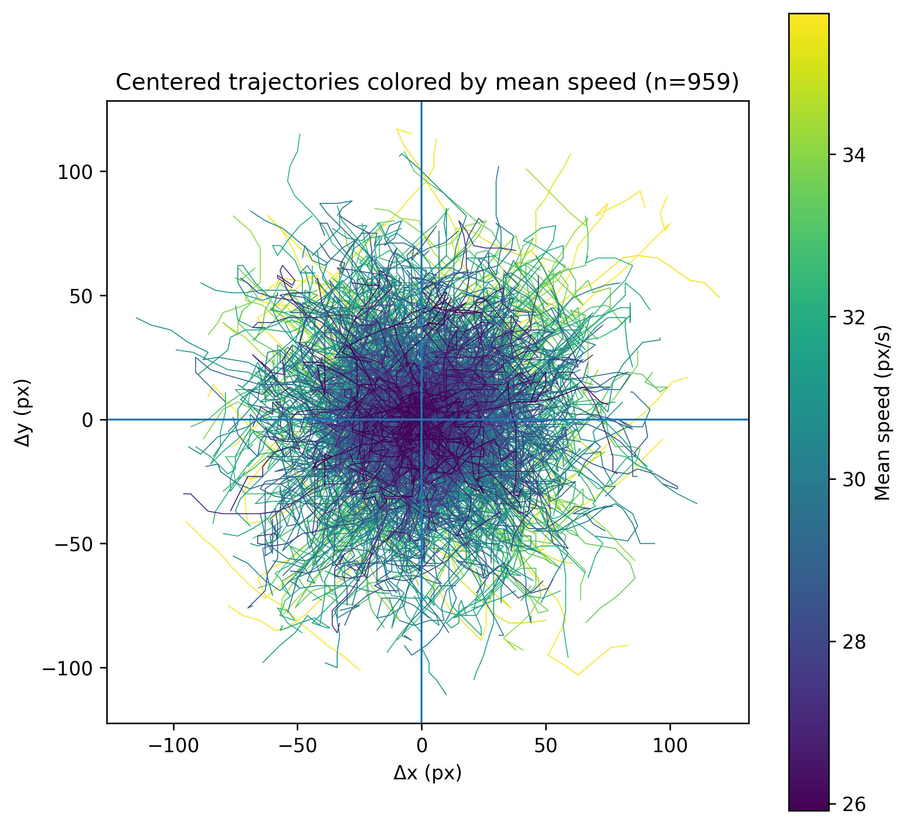

# Zoospore motility prototype

This document describes the zoospore motility prototype implemented in `ca_zoospore.ml`.

The model is a toy agent-based extension of the **Automates** framework. It represents zoospores as motile agents moving on a two-dimensional grid. The purpose of this plugin is not to reproduce the detailed hydrodynamics of zoospore swimming, but to provide a practical rule-based prototype for exploring how local movement rules can generate effective trajectories.

The current version should therefore be considered exploratory.

> **Status:** not validated by biological data.



---

## General principle

Each zoospore is represented as an agent occupying one grid cell.

At each internal model cycle, a zoospore:

1. keeps or slightly modifies its swimming direction;
2. moves by one or two grid cells;
3. leaves its previous position empty;
4. changes direction if it collides with another zoospore;
5. is recorded for trajectory export during a predefined acquisition window.

The model uses the grid as a spatial support, but each zoospore carries additional internal information, including its identity, age, direction, and trajectory metadata.

---

## Zoospore state

Each zoospore stores the following information:

```ocaml
type zoospore = {
  id : int;
  age : int;
  angle : int;
  track_start : int;
  track : (int * float * float) list;
  track_wrapped : bool;
}
```

These fields are used as follows:

- `id`: stable identifier of the zoospore;
- `age`: age of the zoospore, mostly used for display;
- `angle`: internal swimming direction;
- `track_start`: first internal cycle at which trajectory recording starts;
- `track`: recorded trajectory points;
- `track_wrapped`: indicates whether the trajectory crossed a periodic boundary.

Trajectories that cross a periodic boundary are excluded from the exported XML file.

---

## Movement parameters

Zoospore movement is controlled through parameters defined in the automaton database file.

A typical rule entry has the following structure:

```text
AUTOMATON "example_name": D360/F0.10/W3/P12/A30/M1
```

The parameters are:

| Parameter | Meaning | Typical value |
|---|---|---|
| `D` | number of internal angular states | `D360` |
| `F` | probability of moving two cells instead of one | `F0.05` to `F0.20` |
| `W` | small angular noise during free swimming | `W1` to `W5` |
| `P` | average number of cycles before spontaneous reorientation | `P12` |
| `A` | minimal reorientation angle after collision, in degrees | `A30` |
| `M` | maximal display age | `M1` |

---

## Directional persistence

The model includes directional persistence.

During free swimming, a zoospore usually keeps a direction close to its previous direction. Small angular deviations are introduced through the `W` parameter.

Spontaneous reorientation occurs with probability:

```text
1 / P
```

where `P` is the persistence parameter.

For example:

```text
P12
```

means that, on average, a zoospore spontaneously changes direction once every 12 internal cycles.

---

## Angular resolution

The `D` parameter defines the number of internal angular states.

For example:

```text
D360
```

means that the model uses 360 internal angular states, so one angular unit corresponds to one degree.

The actual movement still occurs on the grid, using the eight Moore-neighborhood directions:

```text
E, NE, N, NW, W, SW, S, SE
```

The internal angle is therefore converted into one of these eight possible displacement directions at each movement step.

This design gives the agent a continuous-like internal direction while keeping the spatial update compatible with a cellular automaton grid.

---

## Speed model

At each internal cycle, a zoospore moves either one or two grid cells.

The probability of moving two cells is controlled by the `F` parameter.

For example:

```text
F0.10
```

means that a zoospore moves:

- one cell in 90% of cycles;
- two cells in 10% of cycles.

Since the speed is bounded between one and two cells per cycle, the expected speed is:

```text
mean speed = 1 + F
```

Thus, with `F0.10`, the expected displacement is:

```text
1.10 cells per internal cycle
```

This simple rule produces a bounded, right-skewed speed distribution.

---

## Collision behavior

If a zoospore attempts to move into an occupied position, the movement is cancelled.

The zoospore remains in place, but its swimming angle is modified by at least the angle specified by the `A` parameter.

For example:

```text
A30
```

means that, after collision, the new direction differs from the previous one by at least 30 degrees.

This rule provides a simple way to model reorientation after contact or local obstruction.

---

## Internal cycles and observable frames

The plugin distinguishes between internal model cycles and exported trajectory frames.

The current trajectory export parameters are:

```ocaml
let track_length = 20
let track_stride = 6
let track_end_max = 1000
```

This means that each exported trajectory contains:

```text
20 recorded positions
```

sampled every:

```text
6 internal cycles
```

Thus, one exported trajectory spans:

```text
(20 - 1) × 6 = 114 internal cycles
```

In practice, one observable trajectory point can be interpreted as the result of several internal movement cycles.

This reduces the visible lattice artefact and produces smoother effective trajectories without changing the underlying rule-based model.

---

## Trajectory acquisition

Each zoospore receives its own acquisition window.

The start of trajectory recording is distributed across zoospores rather than forcing all trajectories to begin at `t = 0`.

This avoids recording only the initial synchronized behavior of the population and provides a broader temporal sampling of the simulation.

The latest possible acquisition start is computed so that complete trajectories can still be recorded before `track_end_max`.

With the current parameters:

```text
track_length = 20
track_stride = 6
track_end_max = 1000
```

the latest acquisition start is:

```text
1000 - 114 = 886
```

To recover all complete trajectories, the simulation should therefore be run until at least internal cycle:

```text
t = 1000
```

---

## Periodic boundaries and trajectory filtering

The simulation space uses periodic boundaries.

However, trajectories that cross a periodic boundary are not exported, because the corresponding jump would appear as an artificial long-distance displacement in trajectory analysis.

The plugin therefore tracks whether a zoospore crosses the toric boundary during its acquisition window.

If this happens, the trajectory is marked as wrapped:

```ocaml
track_wrapped = true
```

and is excluded from `tracks.xml`.

This filtering affects only the exported trajectories. It does not change the simulation itself.

---

## Exported trajectory file

The plugin writes trajectories to:

```text
tracks.xml
```

in the current working directory.

The file is written during the simulation and contains one `<particle>` element per exported zoospore trajectory.

The format is compatible with simple particle-tracking analysis scripts.

Example:

```xml
<?xml version="1.0" encoding="UTF-8"?>
<Tracks>
  <particle id="12" start="48" wrapped="false">
    <detection t="48" x="120.500000" y="95.500000"/>
    <detection t="54" x="124.500000" y="98.500000"/>
    <detection t="60" x="128.500000" y="101.500000"/>
  </particle>
</Tracks>
```

Each detection contains:

- `t`: internal model cycle;
- `x`: x coordinate of the cell center;
- `y`: y coordinate of the cell center.

Coordinates are exported as cell centers:

```text
x = column + 0.5
y = row + 0.5
```

---

## Recovering trajectories

To recover simulated zoospore trajectories:

1. Select the zoospore plugin in Automates.
2. Run the simulation until at least the desired final acquisition time.
3. Stop the simulation after `track_end_max` if complete trajectories are required.
4. Retrieve the file:

```text
tracks.xml
```

from the directory where Automates was launched.

The file can then be analysed with a Python script expecting the following structure:

```xml
<particle>
  <detection t="..." x="..." y="..."/>
  <detection t="..." x="..." y="..."/>
</particle>
```

A typical analysis consists of:

- sorting detections by `t`;
- extracting `(x, y)` positions;
- recentering trajectories on their first point;
- computing trajectory length;
- computing mean speed;
- plotting trajectories colored by mean speed.

---

## Recommended interpretation

The current model should be interpreted as a proof of concept for agent-based spatial prototyping.

It can be used to test whether the Automates framework can:

- represent motile biological agents;
- store individual agent states;
- simulate local interactions;
- export trajectories;
- generate data structures comparable to experimental tracking outputs.

It should not yet be interpreted as a calibrated model of real zoospore swimming.

---

## Possible validation metrics

Future comparison with experimental zoospore trajectories should rely on explicit observables, such as:

- mean speed;
- net displacement;
- trajectory length;
- tortuosity;
- directional persistence;
- angle distributions;
- mean squared displacement;
- frequency of collisions or reorientations;
- spatial isotropy.

The model can then be adjusted by tuning parameters such as `F`, `W`, `P`, and `A`.

---

## Current limitations

The current implementation has several deliberate simplifications:

- movement occurs on a discrete grid;
- only eight spatial displacement directions are available;
- speed is limited to one or two cells per internal cycle;
- hydrodynamics are not represented;
- flagellar beating is not represented;
- biological parameters have not yet been fitted to experimental data;
- boundary-crossing trajectories are excluded rather than unwrapped.

These limitations are acceptable for a prototype, but should be addressed or explicitly discussed before biological interpretation.

---

## Summary

The zoospore plugin implements a minimal agent-based motility model on a cellular automaton grid.

Its main purpose is to demonstrate that Automates can be used to prototype motile biological agents and export their trajectories in a format suitable for downstream analysis.

The current implementation is useful for methodological development, visualization, and early-stage hypothesis formalization, but remains:

```text
not validated by biological data
```
