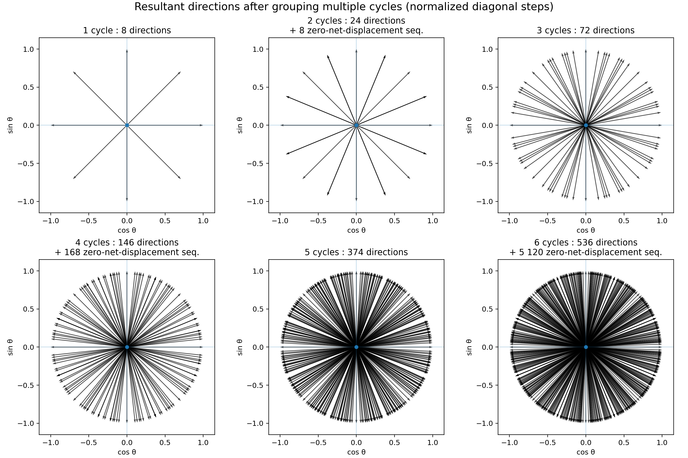
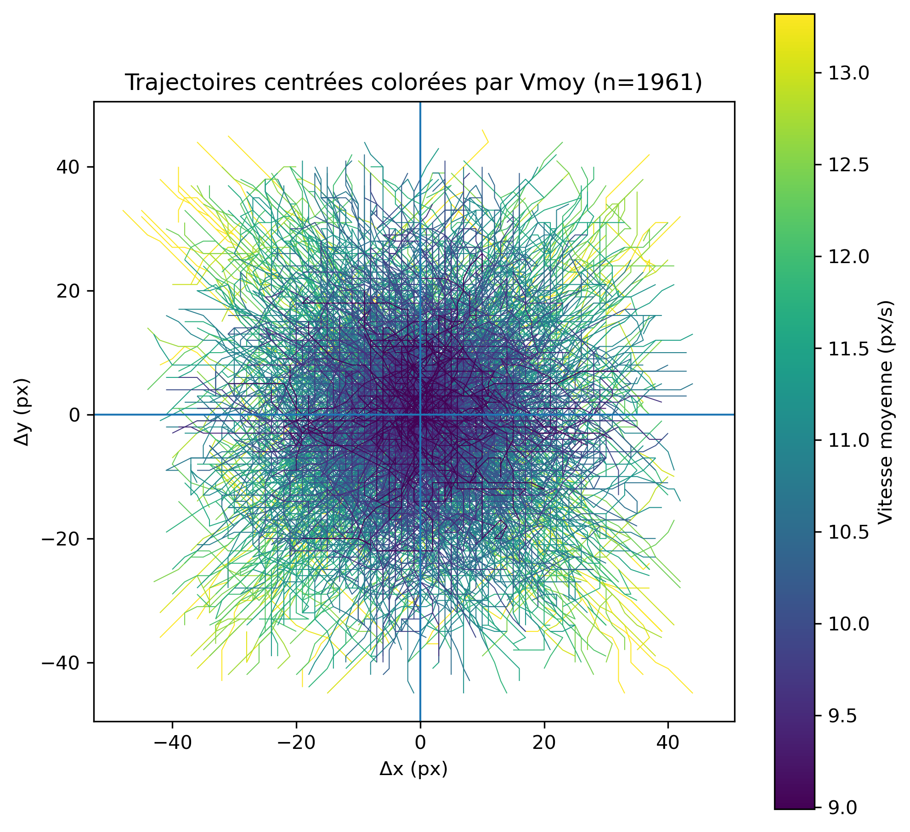
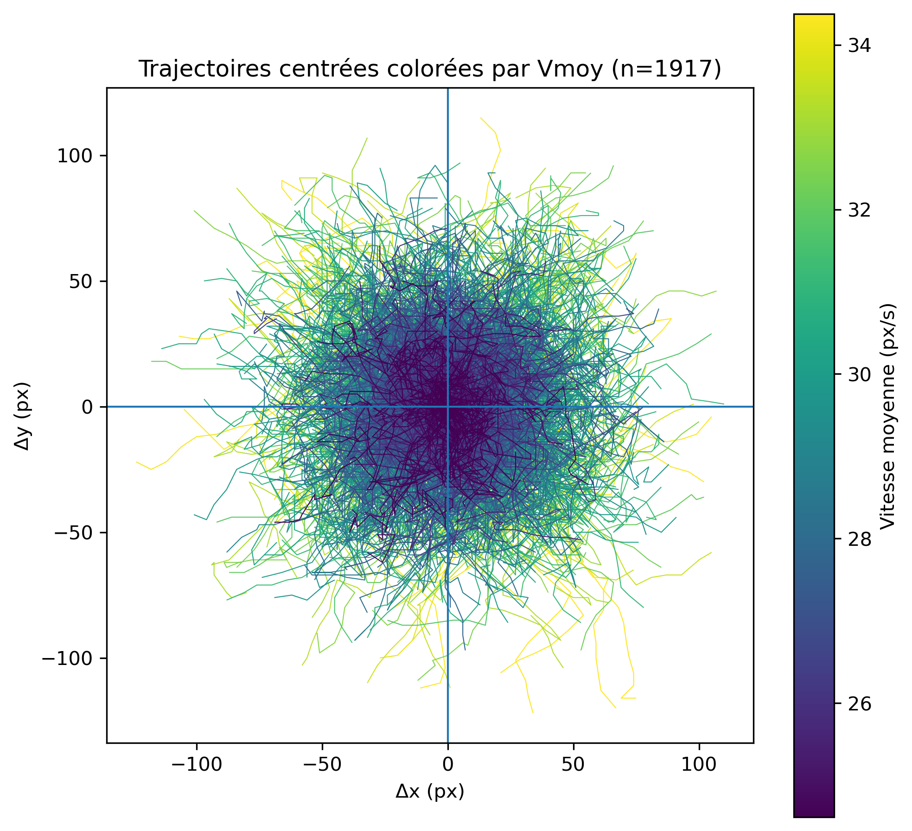

# Zoospore motility prototype

This document describes the zoospore motility prototype implemented in `ca_zoospore.ml`.
The model is an exploratory agent-based extension of the **Automates** framework. It represents oomycete zoospores as motile agents moving on a two-dimensional grid.

> **Status:** exploratory prototype; not yet validated with biological trajectory data.

---

## 1. Biological motivation

Oomycete zoospores are motile, wall-less, biflagellate cells produced by many plant-pathogenic species. They are central to infection because they allow the pathogen to disperse in water films, reach host tissues, respond to environmental cues, and eventually encyst near suitable infection sites. For plant pathologists, zoospore motility is therefore not a peripheral trait. It is one of the earliest steps linking environmental conditions to host colonisation. Even before penetration and effector delivery, the pathogen must solve a spatial problem: how to move, persist, reorient, avoid obstacles, and encounter the host surface. The present model focuses on this pre-infection motility phase.

---

## 2. Why model zoospore swimming?

Experimental tracking can provide trajectories, speeds, persistence, turning angles, and spatial distributions. However, these observables are difficult to interpret directly because the apparent trajectory of each cell emerges from several coupled processes:

- directional persistence;
- stochastic angular noise;
- occasional spontaneous reorientation;
- collisions or local crowding;
- finite spatial resolution;
- finite temporal sampling;
- possible biases imposed by the observation window.

A minimal computational model is useful because it allows these processes to be separated and tested one by one. In this context, the model asks a simple question:

> Can a small set of local movement rules generate trajectories that resemble observable zoospore tracks?

---

## 3. General modelling principle

Each zoospore is represented as an agent occupying one grid cell. The grid 
provides the spatial support of the cellular automaton, while each zoospore 
carries its own internal state.

At each **model cycle**, a zoospore:

1. keeps or slightly modifies its swimming direction;
2. moves by one or two grid cells;
3. leaves its previous position empty;
4. changes direction if it collides with another zoospore;
5. is recorded for trajectory export when it falls within its acquisition window.

The important distinction is that a **model cycle** is an elementary 
computational update, not necessarily a biological video frame or a fixed unit 
of real time. A **real-time trajectory  step** can be represented by grouping 
several model cycles together.

This distinction is essential because a single model cycle is constrained by 
the grid, whereas the grouped displacement over several cycles can approximate 
a much finer set of effective directions.

---

## 4. Zoospore state

Each zoospore stores the following information:

```ocaml
type zoospore = {
  id : int;
  age : int;
  angle : int;
  track_start : int;
  track : (int * float * float) list;
  track_wrapped : bool;
}
```

These fields are used as follows:

| Field | Meaning |
|---|---|
| `id` | stable identifier of the zoospore |
| `age` | age of the zoospore, mostly used for display |
| `angle` | internal swimming direction |
| `track_start` | first model cycle at which trajectory recording starts |
| `track` | recorded trajectory points |
| `track_wrapped` | indicates whether the trajectory crossed a periodic boundary |

Trajectories that cross a periodic boundary are excluded from the exported XML 
file, because the corresponding jump would appear as an artificial long-distance 
displacement in downstream tracking analysis.

---

## 5. Movement parameters

Zoospore movement is controlled through parameters defined in the automaton 
database file.

A typical rule entry has the following structure:

```text
AUTOMATON "example_name": D360/F0.10/W3/P12/A30/M1
```

The parameters are:

| Parameter | Meaning | Typical value |
|---|---|---|
| `D` | number of internal angular states | `D360` |
| `F` | probability of moving two cells instead of one | `F0.05` to `F0.20` |
| `W` | small angular noise during free swimming | `W1` to `W5` |
| `P` | average number of model cycles before spontaneous reorientation | `P12` |
| `A` | minimal reorientation angle after collision, in degrees | `A30` |
| `M` | maximal display age | `M1` |

Together, these parameters define a bounded persistent random walk on a cellular
automaton grid.

---

## 6. Directional persistence and angular noise

The model includes directional persistence. During free swimming, a zoospore 
usually keeps a direction close to its previous direction. Small angular 
deviations are introduced through the `W` parameter.

Spontaneous reorientation occurs with probability:

```text
1 / P
```

where `P` is the persistence parameter.

For example:

```text
P12
```

means that, on average, a zoospore spontaneously changes direction once every 
12 model cycles.

The `D` parameter defines the number of internal angular states. For example:

```text
D360
```

means that the model uses 360 internal angular states, so one angular unit 
corresponds to one degree.

The actual displacement still occurs on the grid, using the eight 
Moore-neighbourhood directions:

```text
E, NE, N, NW, W, SW, S, SE
```

Thus, the zoospore has a fine internal direction, but each elementary model 
cycle must still be converted into one of eight possible grid displacements.

---

## 7. Speed model

At each model cycle, a zoospore moves either one or two grid cells.

The probability of moving two cells is controlled by the `F` parameter. For example:

```text
F0.10
```

means that a zoospore moves:

- one cell in 90% of model cycles;
- two cells in 10% of model cycles.

Since the speed is bounded between one and two cells per model cycle, the expected displacement is:

```text
mean displacement per model cycle = 1 + F
```

Thus, with `F0.10`, the expected displacement is:

```text
1.10 cells per model cycle
```

This simple rule produces a bounded, right-skewed speed distribution.

---

## 8. Collision behaviour

If a zoospore attempts to move into an occupied position, the movement is cancelled.

The zoospore remains in place, but its swimming angle is modified by at least 
the angle specified by the `A` parameter.

For example:

```text
A30
```

means that, after collision, the new direction differs from the previous one by 
at least 30 degrees.

This rule provides a simple way to model reorientation after contact, crowding, 
or local obstruction.

---

## 9. Model cycles versus real-time trajectory frames

The plugin distinguishes between:

| Concept | Meaning |
|---|---|
| **model cycle** | one elementary update of the cellular automaton |
| **real-time trajectory step** | one exported trajectory interval, corresponding to several model cycles |
| `track_stride` | number of model cycles grouped into one exported trajectory step |

The current trajectory export parameters are:

```ocaml
let track_length = 20
let track_stride = 6
let track_end_max = 1000
```

This means that each exported trajectory contains:

```text
20 recorded positions
```

sampled every:

```text
6 model cycles
```

Thus, one exported trajectory spans:

```text
(20 - 1) × 6 = 114 model cycles
```

In other words:

```text
1 real-time trajectory step = track_stride model cycles
```

This is not merely a technical export parameter. It is also the bridge between 
the discrete automaton and the effective biological trajectory. The underlying 
model remains grid-based, but the observed displacement over several model 
cycles can have a much finer apparent direction.

---

## 10. Why grouping multiple model cycles gives smoother trajectories

A single model cycle can only move a zoospore toward one of the eight 
Moore-neighbourhood directions. This creates an unavoidable lattice constraint 
at the elementary update scale.

However, when several model cycles are grouped into one real-time trajectory 
step, the resulting displacement is the sum of several elementary moves. The 
number of possible elementary sequences grows rapidly:

```text
number of elementary sequences after k model cycles = 8^k
```

Many different sequences collapse onto the same final displacement, and several 
displacements may share the same direction. Nevertheless, the number of possible
resultant directions increases strongly with `k`.



*Figure 1. Resultant directions obtained by grouping several model cycles. With one model cycle, the movement is restricted to eight directions. With six model cycles per real-time trajectory step, the effective direction space becomes dense enough to approximate a quasi-isotropic effective movement.*

For even values of `k`, some sequences can return exactly to the starting point. 
These are zero-net-displacement sequences. They should not necessarily be 
interpreted as immobility: they can also represent local swimming activity, 
hesitation, or reorientation without net displacement over the observation interval.

With this method, the direction space is not mathematically perfectly isotropic, 
but the visible lattice artefact is strongly reduced.

---

## 11. Effect of the real-time stride on simulated trajectories

The effect of grouping model cycles is visible when comparing exported 
trajectories using different `track_stride` values.

With a small stride, the grid constraint remains apparent. The trajectories 
still reveal the limited angular alphabet available to the automaton.



*Figure 2. Centred simulated zoospore trajectories when one real-time trajectory step corresponds to two model cycles. The movement is already aggregated, but lattice effects remain visible.*

With a larger stride, each recorded displacement integrates more elementary 
model cycles. The resulting tracks become smoother and more similar to 
experimentally observed swimming trajectories.



*Figure 3. Centred simulated zoospore trajectories when one real-time trajectory step corresponds to six model cycles. The effective trajectories are smoother and the directional discretisation is much less apparent.*

This supports the following interpretation:

> The cellular automaton should be understood as a fine computational substrate. Biologically meaningful trajectory points correspond to aggregated displacements over several model cycles.

---

## 12. Trajectory acquisition

Each zoospore receives its own acquisition window.

The start of trajectory recording is distributed across zoospores rather than 
forcing all trajectories to begin at `t = 0`. This avoids recording only the 
initial synchronized behaviour of the population and provides a broader temporal 
sampling of the simulation.

The latest possible acquisition start is computed so that complete trajectories 
can still be recorded before `track_end_max`.

With the current parameters:

```text
track_length = 20
track_stride = 6
track_end_max = 1000
```

the latest acquisition start is:

```text
1000 - 114 = 886
```

To recover all complete trajectories, the simulation should therefore be run 
until at least:

```text
t = 1000 model cycles
```

---

## 13. Periodic boundaries and trajectory filtering

The simulation space uses periodic boundaries.

However, trajectories that cross a periodic boundary are not exported, because 
the corresponding jump would appear as an artificial long-distance displacement 
in trajectory analysis.

The plugin therefore tracks whether a zoospore crosses the toric boundary 
during its acquisition window.

If this happens, the trajectory is marked as wrapped:

```ocaml
track_wrapped = true
```

and is excluded from `tracks.xml`.

This filtering affects only the exported trajectories. It does not change the simulation itself.

---

## 14. Exported trajectory file

The plugin writes trajectories to:

```text
tracks.xml
```

in the current working directory.

The file is written during the simulation and contains one `<particle>` element 
per exported zoospore trajectory.

The format is compatible with simple particle-tracking analysis scripts.

Example:

```xml
<?xml version="1.0" encoding="UTF-8"?>
<Tracks>
  <particle id="12" start="48" wrapped="false">
    <detection t="48" x="120.500000" y="95.500000"/>
    <detection t="54" x="124.500000" y="98.500000"/>
    <detection t="60" x="128.500000" y="101.500000"/>
  </particle>
</Tracks>
```

Each detection contains:

| Attribute | Meaning |
|---|---|
| `t` | model cycle |
| `x` | x coordinate of the cell centre |
| `y` | y coordinate of the cell centre |

Coordinates are exported as cell centres:

```text
x = column + 0.5
y = row + 0.5
```

---

## 15. Recovering trajectories

To recover simulated zoospore trajectories:

1. Select the zoospore plugin in Automates.
2. Run the simulation until at least the desired final acquisition time.
3. Stop the simulation after `track_end_max` if complete trajectories are required.
4. Retrieve the file:

```text
tracks.xml
```

from the directory where Automates was launched.

The file can then be analysed with a Python script expecting the following structure:

```xml
<particle>
  <detection t="..." x="..." y="..."/>
  <detection t="..." x="..." y="..."/>
</particle>
```

A typical analysis consists of:

- sorting detections by `t`;
- extracting `(x, y)` positions;
- recentering trajectories on their first point;
- computing trajectory length;
- computing mean speed;
- plotting trajectories coloured by mean speed.

---

## 16. Recommended interpretation

The current model should be interpreted as a proof of concept for agent-based spatial prototyping.
It can be used to test whether the Automates framework can:

- represent motile biological agents;
- store individual agent states;
- simulate local interactions;
- export trajectories;
- generate data structures comparable to experimental tracking outputs.

It should not yet be interpreted as a calibrated model of real zoospore swimming.

The most important conceptual point is the separation between the **model cycle** and **real time**:

> A model cycle is the elementary grid-based computation. A real-time trajectory step is an aggregated displacement over several model cycles.

This separation allows a grid-based automaton to produce effective trajectories 
that are much smoother than the elementary eight-direction movement rule.

---

## 17. Possible validation metrics

Future comparison with experimental zoospore trajectories should rely on explicit observables, such as:

- mean speed;
- net displacement;
- trajectory length;
- tortuosity;
- directional persistence;
- angle distributions;
- mean squared displacement;
- frequency of collisions or reorientations;
- spatial isotropy;
- distribution of zero-net-displacement intervals.

The model can then be adjusted by tuning parameters such as `F`, `W`, `P`, `A`, 
and `track_stride`.

---

## 18. Current limitations

The current implementation has several deliberate simplifications:

- movement occurs on a discrete grid;
- a single model cycle has only eight spatial displacement directions;
- speed is limited to one or two cells per model cycle;
- hydrodynamics are not represented;
- flagellar beating is not represented;
- boundary-crossing trajectories are excluded rather than unwrapped.

---

## Summary

The zoospore plugin implements a minimal agent-based motility model on a 
cellular automaton grid.

Its main purpose is to demonstrate that Automates can be used to prototype 
motile biological agents and export their trajectories in a format suitable for 
downstream analysis.

The key modelling idea is that realistic trajectories do not need to emerge 
from a single elementary grid update. Instead, each observed real-time 
displacement can be interpreted as the result of several internal model cycles. 
This aggregation transforms the eight-direction movement constraint into a much 
denser set of effective directions. The model cycle should therefore be 
interpreted as a computational sub-step, whereas the exported trajectory step 
corresponds to the time scale at which motility is observed and analysed.
